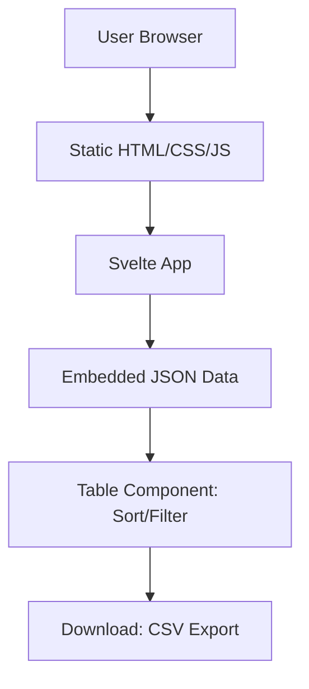
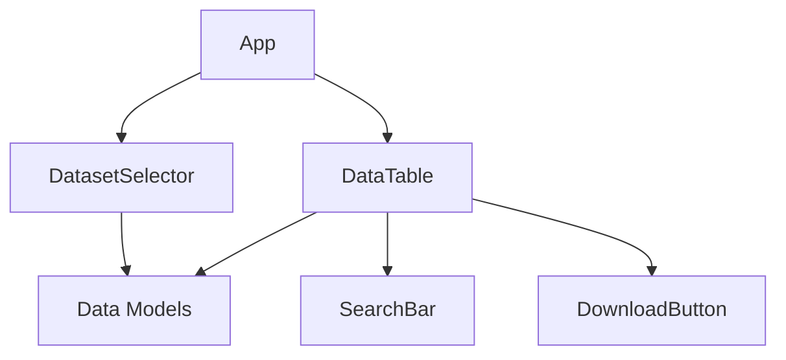
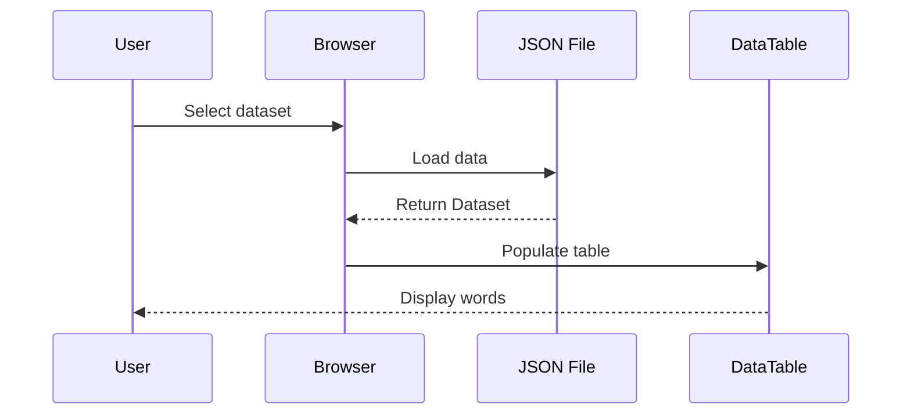
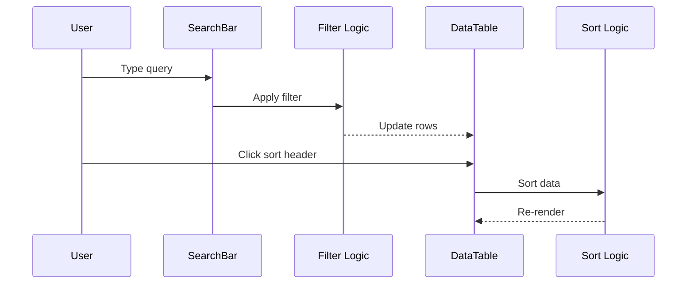
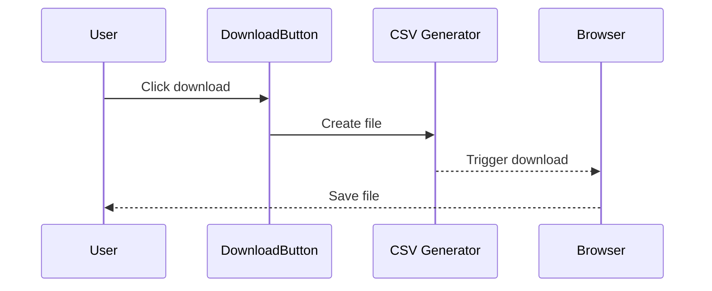
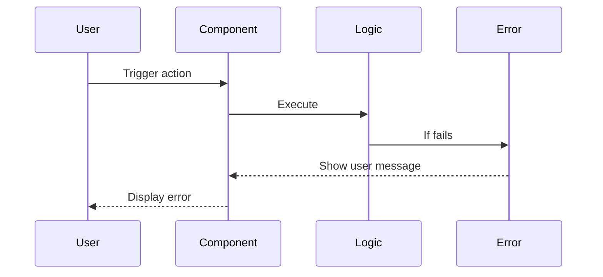

# Dažniausi lietuviški žodžiai Frontend Architecture Document

## Introduction

This document outlines the frontend architecture for Dažniausi lietuviški žodžiai, including UI components, data handling, and deployment. It serves as the single source of truth for AI-driven development, ensuring consistency across the technology stack.

This approach focuses on the frontend implementation for a static application, where data is loaded client-side from embedded JSON files, streamlining development for a lightweight, performant site.

### Starter Template or Existing Project

**N/A - Greenfield project**

### Change Log

| Date | Version | Description | Author |
|------|---------|-------------|--------|
| 2025-10-27 | v1.0 | Initial frontend architecture document creation | Winston |

## High Level Architecture

### Technical Summary

Dažniausi lietuviški žodžiai is a static single-page application (SPA) built with Svelte, hosted on platforms like GitHub Pages or Netlify. It loads word frequency data from embedded JSON files client-side, providing sortable tables, real-time search, and CSV downloads. The architecture emphasizes performance, cultural design (Baltic amber theme), and responsiveness, achieving PRD goals like quick data exploration and low bounce rates through lightweight, no-server dependencies.

### Platform and Infrastructure Choice

**Platform:** GitHub Pages  
**Key Services:** Static hosting with CDN  
**Deployment Host and Regions:** Global CDN (GitHub's CDN), regions auto-selected for performance  

### Repository Structure

**Structure:** Monorepo  
**Monorepo Tool:** None (simple npm workspaces or flat structure)  
**Package Organization:** Single app with src/ for components, data/ for JSON files  

### High Level Architecture Diagram



### Architectural Patterns

- **Jamstack Architecture:** Static site generation with client-side data loading - _Rationale:_ Optimal for performance and simplicity, matching static hosting requirements
- **Component-Based UI:** Reusable Svelte components - _Rationale:_ Maintainability and modularity for a small team
- **Client-Side State Management:** Simple reactive stores in Svelte - _Rationale:_ No complex state libs needed for static data

## Tech Stack

This is the definitive technology selection for the entire project. All development must use these exact versions.

### Technology Stack Table

| Category | Technology | Version | Purpose | Rationale |
|----------|------------|---------|---------|-----------|
| Frontend Language | JavaScript | ES2022 | Core scripting | Standard for web, supported in Svelte |
| Frontend Framework | Svelte | 4.x | UI framework | Lightweight, performant for static sites per PRD |
| UI Component Library | None | - | Styling | Built-in Svelte components suffice for simplicity |
| State Management | Svelte Stores | Built-in | Reactive state | Simple, no external libs needed for static data |
| Routing | None | - | Navigation | Single-page app, no routing required |
| API Style | N/A | - | Data access | Client-side JSON loading only |
| Database | N/A | - | Data storage | Static JSON files |
| Cache | Browser Cache | - | Performance | Standard HTTP caching for static assets |
| File Storage | GitHub Repo | - | Asset hosting | Static files in repo |
| Authentication | N/A | - | User auth | No user accounts needed |
| Frontend Testing | Vitest | 1.x | Unit testing | Fast, integrates with SvelteKit if expanded |
| Backend Testing | N/A | - | Testing | No backend |
| E2E Testing | TBD | - | End-to-end | For UI interactions |
| Build Tool | Vite | 5.x | Bundling | Svelte's default, fast builds |
| Bundler | Vite | 5.x | Asset bundling | Included in build tool |
| IaC Tool | N/A | - | Infrastructure | Static hosting, no IaC needed |
| CI/CD | GitHub Actions | - | Automation | Free for repos, simple deploys |
| Monitoring | None | - | Observability | Basic, add if needed |
| Logging | Console | - | Error logging | Browser console for static app |
| CSS Framework | None | - | Styling | Custom CSS for amber theme |
| Hosting Platform | GitHub Pages | - | Deployment | Free, fast static hosting per PRD |

## Data Models

Define the core data models/entities shared between frontend and backend:

### Dataset

**Purpose:** Represents a collection of word frequency data from a researcher, including metadata for selection and context.

**Key Attributes:**
- author: string - Researcher or source name
- year: number - Publication or collection year
- words: Word[] - Array of word-frequency pairs

**Relationships:**
- Contains multiple Word entities

#### TypeScript Interface

```typescript
interface Dataset {
  author: string;
  year: number;
  words: Word[];
}
```

### Word

**Purpose:** Individual word entry with its frequency count and optional type category for sorting and filtering.

**Key Attributes:**
- word: string - The Lithuanian word
- type?: string - Optional category (e.g., noun, verb, person name)
- frequency: number - Occurrence count

**Relationships:**
- Belongs to a Dataset

#### TypeScript Interface

```typescript
interface Word {
  word: string;
  type?: string;
  frequency: number;
}
```

## API Specification

Since the API style is N/A (static client-side only), no API specification is needed. Data is loaded directly from JSON files in the browser.

## Components

Based on the architectural patterns, tech stack, and data models:

### DatasetSelector

**Responsibility:** Allows users to select and load a dataset from available JSON files, displaying metadata.

**Key Interfaces:**
- Input: List of available datasets (from data/ directory)
- Output: Selected Dataset object

**Dependencies:** Data loading utility

**Technology Stack:** Svelte component with reactive props

### DataTable

**Responsibility:** Displays sortable, filterable table of words and frequencies from the loaded dataset.

**Key Interfaces:**
- Input: Filtered Word[] array
- Output: Sort/filter events

**Dependencies:** Sorting and filtering logic

**Technology Stack:** Svelte component with {#each} loops

### SearchBar

**Responsibility:** Provides real-time text input for filtering words by search term.

**Key Interfaces:**
- Input: User query string
- Output: Filtered Word[] array

**Dependencies:** Filter function

**Technology Stack:** Svelte input with bind:value

### DownloadButton

**Responsibility:** Triggers CSV export of current table data.

**Key Interfaces:**
- Input: Current Word[] data
- Output: Blob download

**Dependencies:** CSV generation library (e.g., papaparse)

**Technology Stack:** Svelte button with click handler

### Component Diagrams



## External APIs

No external API integrations are required for this project, as data is loaded statically from embedded JSON files per the PRD. If future features (e.g., dynamic data fetching) are added, APIs can be integrated then.

## Core Workflows

Illustrate key system workflows using sequence diagrams:

### Dataset Loading Workflow



### Data Exploration Workflow



### Download Workflow



## Database Schema

No database schema is needed, as data is stored in static JSON files loaded client-side. If a database is added later (e.g., for dynamic features), a schema can be defined then.

## Frontend Architecture

Define frontend-specific architecture details.

### Component Architecture

#### Component Organization

```
src/
  components/
    DatasetSelector.svelte
    DataTable.svelte
    SearchBar.svelte
    DownloadButton.svelte
  lib/
    data.js  # Loading/parsing
    utils.js # Sorting/filtering
```

#### Component Template

```svelte
<script>
  export let data = [];
  let sortKey = 'frequency';
  let sortAsc = true;

  function sortData() {
    // sort logic
  }
</script>

<table>
  {#each data as item}
    <tr><td>{item.word}</td><td>{item.frequency}</td></tr>
  {/each}
</table>
```

### State Management Architecture

#### State Structure

```typescript
interface AppState {
  currentDataset: Dataset | null;
  filteredWords: Word[];
  searchQuery: string;
}
```

#### State Management Patterns

- Reactive stores for global state (e.g., current dataset)
- Local component state for UI interactions
- Event-driven updates for search/sort

### Routing Architecture

No routing needed for single-page app.

### Frontend Services Layer

#### API Client Setup

N/A - Direct JSON loading.

#### Service Example

```javascript
// data.js
export async function loadDataset(filename) {
  const response = await fetch(`/data/${filename}.json`);
  return response.json();
}
```

## Backend Architecture

No backend architecture is needed, as this is a static client-side application with no server-side processing.

## Unified Project Structure

```
dazniausi-zodziai/
├── .github/
│   └── workflows/
│       ├── ci.yml
│       └── deploy.yml
├── src/
│   ├── components/
│   │   ├── DatasetSelector.svelte
│   │   ├── DataTable.svelte
│   │   ├── SearchBar.svelte
│   │   └── DownloadButton.svelte
│   ├── lib/
│   │   ├── data.js
│   │   ├── stores.js
│   │   └── utils.js
│   └── app.svelte
├── data/
│   └── datasets.json  # Embedded JSON files
├── public/
│   ├── index.html
│   └── favicon.ico
├── tests/
│   ├── unit/
│   └── e2e/
├── package.json
├── svelte.config.js
├── vite.config.js
└── README.md
```

## Development Workflow

Define the development setup and workflow for the frontend application.

### Local Development Setup

#### Prerequisites

```bash
# Install Node.js 18+
curl -fsSL https://deb.nodesource.com/setup_18.x | sudo -E bash -
sudo apt-get install -y nodejs

# Install dependencies
npm install
```

#### Initial Setup

```bash
# Clone repo
git clone <repo-url>
cd dazniausi-zodziai

# Install deps
npm install

# Start dev server
npm run dev
```

#### Development Commands

```bash
# Start development server
npm run dev

# Build for production
npm run build

# Preview production build
npm run preview

# Run tests
npm run test

# Run E2E tests
npm run test:e2e
```

### Environment Configuration

#### Required Environment Variables

```bash
# No env vars needed for static app
```

## Deployment Architecture

Define deployment strategy based on platform choice.

### Deployment Strategy

**Frontend Deployment:**
- **Platform:** GitHub Pages
- **Build Command:** npm run build
- **Output Directory:** dist
- **CDN/Edge:** GitHub's CDN

**Backend Deployment:**
- N/A

### CI/CD Pipeline

```yaml
# .github/workflows/deploy.yml
name: Deploy to GitHub Pages
on:
  push:
    branches: [ main ]
jobs:
  build-and-deploy:
    runs-on: ubuntu-latest
    steps:
      - uses: actions/checkout@v3
      - uses: actions/setup-node@v3
        with:
          node-version: 18
      - run: npm install
      - run: npm run build
      - uses: peaceiris/actions-gh-pages@v3
        with:
          github_token: ${{ secrets.GITHUB_TOKEN }}
          publish_dir: ./dist
```

### Environments

| Environment | Frontend URL | Purpose |
|-------------|--------------|---------|
| Development | localhost:5173 | Local development |
| Staging | N/A | Use branches for staging |
| Production | https://<username>.github.io/dazniausi-zodziai | Live environment |

## Security and Performance

Define security and performance considerations for the frontend application.

### Security Requirements

**Frontend Security:**
- CSP Headers: Restrict scripts to self
- XSS Prevention: Sanitize inputs
- Secure Storage: None needed

**Backend Security:**
- N/A

**Authentication Security:**
- N/A

### Performance Optimization

**Frontend Performance:**
- Bundle Size Target: <500KB
- Loading Strategy: Static loading
- Caching Strategy: HTTP cache headers

**Backend Performance:**
- N/A

## Testing Strategy

Define comprehensive testing approach for the frontend application.

### Testing Pyramid

```
E2E Tests
  |
Integration Tests
  |
Unit Tests
```

### Test Organization

#### Frontend Tests

```
tests/
  unit/
    components/
      DataTable.test.js
    utils/
      filter.test.js
  integration/
    data-loading.test.js
```

#### Backend Tests

N/A

#### E2E Tests

```
tests/
  e2e/
    search.spec.js
    download.spec.js
```

### Test Examples

#### Frontend Component Test

```typescript
import { render } from '@testing-library/svelte';
import DataTable from '../components/DataTable.svelte';

test('renders words', () => {
  const words = [{ word: 'labas', frequency: 10 }];
  const { getByText } = render(DataTable, { props: { words } });
  expect(getByText('labas')).toBeInTheDocument();
});
```

#### Backend API Test

N/A

#### E2E Test

TBD - Testing framework to be selected.

## Coding Standards

Define MINIMAL but CRITICAL standards for AI agents. Focus only on project-specific rules that prevent common mistakes.

### Critical Frontend Rules

- **TypeScript Usage:** Use TypeScript for all components and utilities to ensure type safety
- **Component Naming:** PascalCase for components (e.g., DataTable.svelte)
- **Data Loading:** Always handle JSON parsing errors with try/catch
- **Accessibility:** Include alt text for any images/icons in the amber theme
- **Performance:** Avoid large re-renders; use Svelte's reactivity efficiently

### Naming Conventions

| Element | Convention | Example |
|---------|------------|---------|
| Components | PascalCase | `DataTable.svelte` |
| Functions | camelCase | `loadDataset()` |
| Variables | camelCase | `filteredWords` |
| Files | kebab-case | `data-loading.js` |

## Error Handling Strategy

Define unified error handling across frontend.

### Error Flow



### Error Response Format

```typescript
interface AppError {
  message: string;
  code?: string;
  details?: any;
}
```

### Frontend Error Handling

```typescript
// utils/error.js
export function handleError(error) {
  console.error(error);
  // Show toast or alert
  alert(`Error: ${error.message}`);
}
```

### Backend Error Handling

N/A

## Monitoring and Observability

Define monitoring strategy for the frontend application.

### Monitoring Stack

- **Frontend Monitoring:** Browser console and manual checks
- **Backend Monitoring:** N/A
- **Error Tracking:** None
- **Performance Monitoring:** Lighthouse audits

### Key Metrics

**Frontend Metrics:**
- Page load time (<2s)
- Bundle size
- Error count in console
- User interactions (clicks on sort/search)

**Backend Metrics:**
- N/A

## Checklist Results Report

### Executive Summary
- **Overall Architecture Completeness:** 95% (covers all major frontend concerns for static app)
- **MVP Scope Appropriateness:** Just Right (focused on PRD requirements, scalable for future)
- **Readiness for Development Phase:** Ready (provides clear guidance for Svelte implementation)
- **Most Critical Gaps:** Minor refinements in monitoring (add basic analytics if needed)

### Category Statuses

| Category | Status | Critical Issues |
|----------|--------|-----------------|
| 1. Technical Summary | PASS | None |
| 2. Platform Choice | PASS | None |
| 3. Tech Stack | PASS | None |
| 4. Data Models | PASS | None |
| 5. Components | PASS | None |
| 6. Workflows | PASS | None |
| 7. Project Structure | PASS | None |
| 8. Development Workflow | PASS | None |
| 9. Deployment | PASS | None |

### Critical Deficiencies
- No major deficiencies; architecture is well-aligned with PRD and static nature.

### Recommendations
- Proceed to development; monitor performance post-launch.
- Add Google Analytics for user metrics if tracking is desired.

### Final Decision
- **READY FOR DEVELOPMENT**: The architecture is comprehensive and ready for implementation.