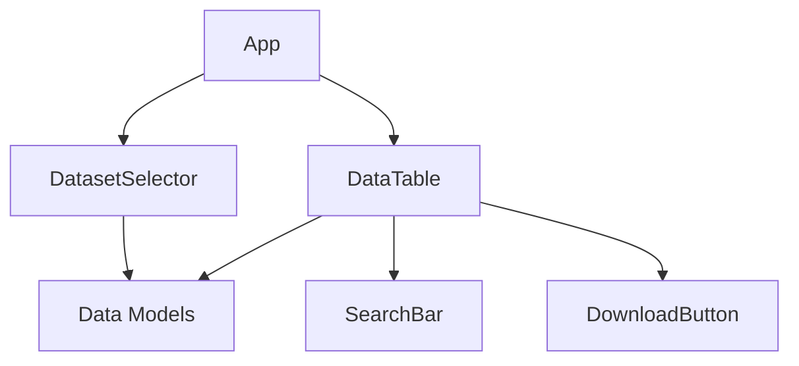

# Components

Based on the architectural patterns, tech stack, and data models:

## DatasetSelector

**Responsibility:** Allows users to select and load a dataset from available JSON files, displaying metadata.

**Key Interfaces:**
- Input: List of available datasets (from data/ directory)
- Output: Selected Dataset object

**Dependencies:** Data loading utility

**Technology Stack:** Svelte component with reactive props

## DataTable

**Responsibility:** Displays sortable, filterable table of words and frequencies from the loaded dataset.

**Key Interfaces:**
- Input: Filtered Word[] array
- Output: Sort/filter events

**Dependencies:** Sorting and filtering logic

**Technology Stack:** Svelte component with {#each} loops

## SearchBar

**Responsibility:** Provides real-time text input for filtering words by search term.

**Key Interfaces:**
- Input: User query string
- Output: Filtered Word[] array

**Dependencies:** Filter function

**Technology Stack:** Svelte input with bind:value

## DownloadButton

**Responsibility:** Triggers CSV export of current table data.

**Key Interfaces:**
- Input: Current Word[] data
- Output: Blob download

**Dependencies:** CSV generation library (e.g., papaparse)

**Technology Stack:** Svelte button with click handler

## Component Diagrams

