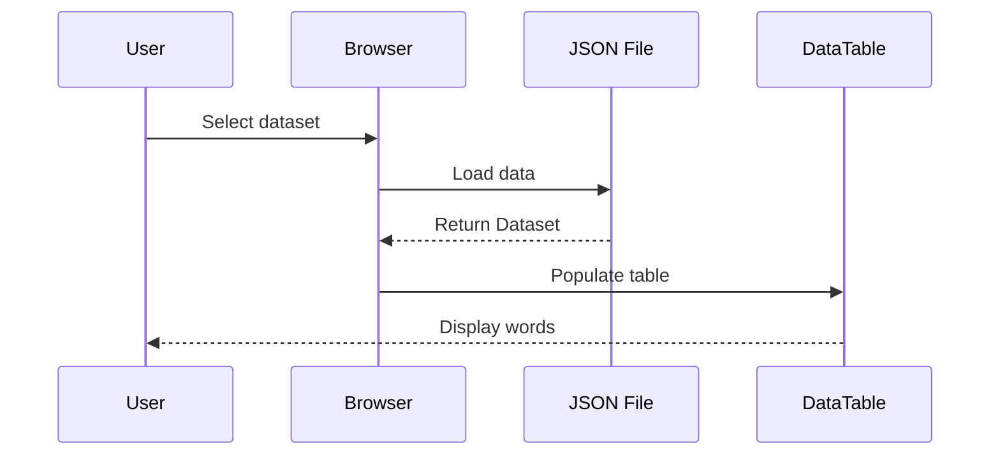
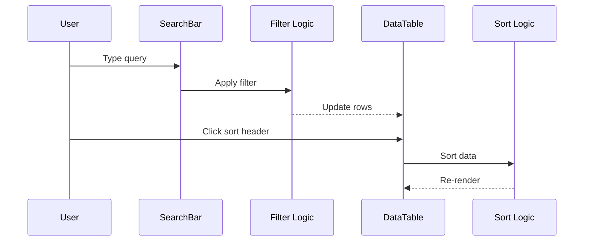
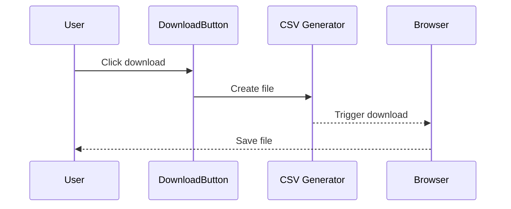

# Core Workflows

Illustrate key system workflows using sequence diagrams:

## Dataset Loading Workflow

```mermaid
sequenceDiagram
    User->>Browser: Select dataset
    Browser->>JSON File: Load data
    JSON File-->>Browser: Return Dataset
    Browser->>DataTable: Populate table
    DataTable-->>User: Display words
```

## Data Exploration Workflow

```mermaid
sequenceDiagram
    User->>SearchBar: Type query
    SearchBar->>Filter Logic: Apply filter
    Filter Logic-->>DataTable: Update rows
    User->>DataTable: Click sort header
    DataTable->>Sort Logic: Sort data
    Sort Logic-->>DataTable: Re-render
```

## Download Workflow

```mermaid
sequenceDiagram
    User->>DownloadButton: Click download
    DownloadButton->>CSV Generator: Create file
    CSV Generator-->>Browser: Trigger download
    Browser-->>User: Save file
```
