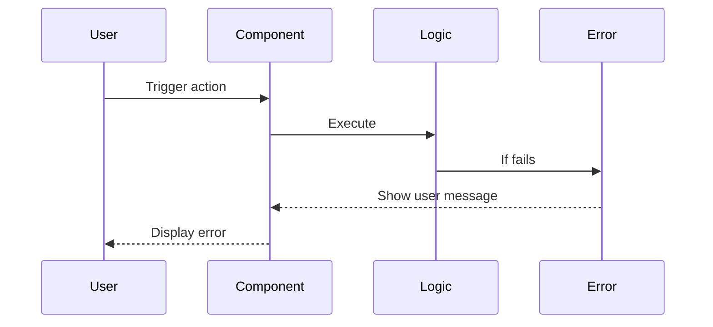

# Error Handling Strategy

Define unified error handling across frontend.

## Error Flow



## Error Response Format

```typescript
interface AppError {
  message: string;
  code?: string;
  details?: any;
}
```

## Frontend Error Handling

```typescript
// utils/error.js
export function handleError(error) {
  console.error(error);
  // Show toast or alert
  alert(`Error: ${error.message}`);
}
```

## Backend Error Handling

N/A
