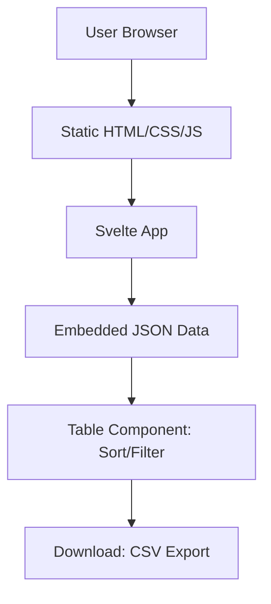

# High Level Architecture

## Technical Summary

Dažniausi lietuviški žodžiai is a static single-page application (SPA) built with Svelte, hosted on platforms like GitHub Pages or Netlify. It loads word frequency data from embedded JSON files client-side, providing sortable tables, real-time search, and CSV downloads. The architecture emphasizes performance, cultural design (Baltic amber theme), and responsiveness, achieving PRD goals like quick data exploration and low bounce rates through lightweight, no-server dependencies.

## Platform and Infrastructure Choice

**Platform:** GitHub Pages  
**Key Services:** Static hosting with CDN  
**Deployment Host and Regions:** Global CDN (GitHub's CDN), regions auto-selected for performance  

## Repository Structure

**Structure:** Monorepo  
**Monorepo Tool:** None (simple npm workspaces or flat structure)  
**Package Organization:** Single app with src/ for components, data/ for JSON files  

## High Level Architecture Diagram

## Architectural Patterns

- **Jamstack Architecture:** Static site generation with client-side data loading - _Rationale:_ Optimal for performance and simplicity, matching static hosting requirements
- **Component-Based UI:** Reusable Svelte components - _Rationale:_ Maintainability and modularity for a small team
- **Client-Side State Management:** Simple reactive stores in Svelte - _Rationale:_ No complex state libs needed for static data
