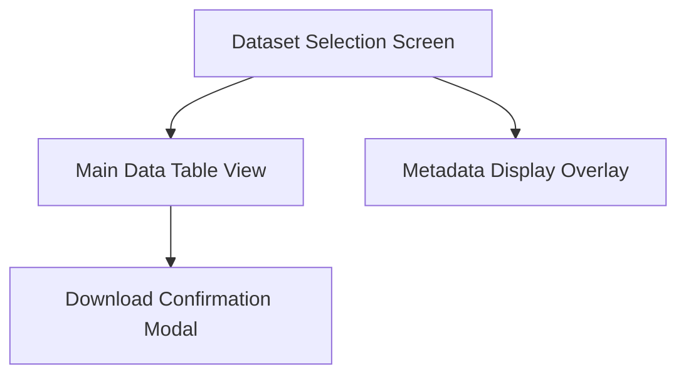
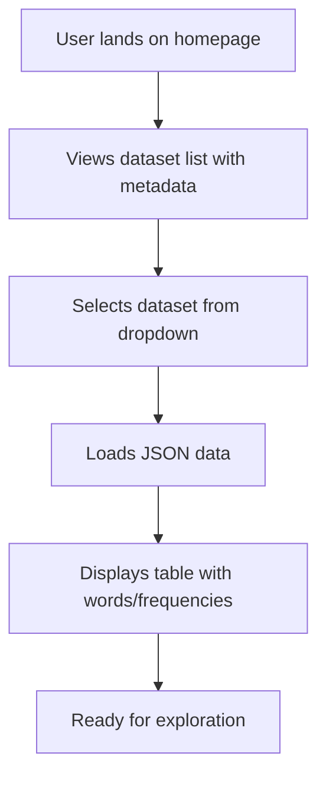
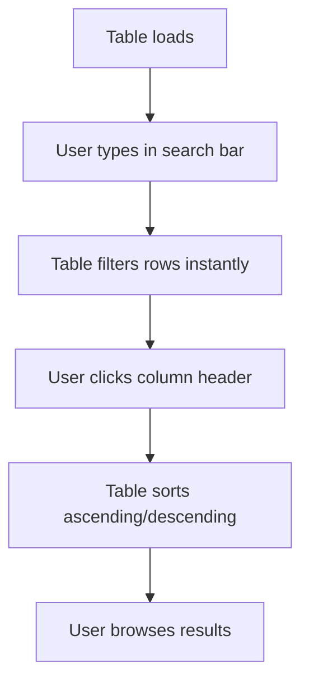

# Dažniausi lietuviški žodžiai UI/UX Specification

## Introduction

This document defines the user experience goals, information architecture, user flows, and visual design specifications for Dažniausi lietuviški žodžiai's user interface. It serves as the foundation for visual design and frontend development, ensuring a cohesive and user-centered experience.

### Overall UX Goals & Principles

#### Target User Personas

- **Linguist:** Academic researchers studying Lithuanian language patterns, frequency distributions, and linguistic trends for scholarly work.
- **Student:** Language learners exploring common Lithuanian vocabulary to build vocabulary and understand usage patterns.
- **Enthusiast:** General users interested in Lithuanian culture, heritage, or casual data exploration without deep academic needs.

#### Usability Goals

- Ease of learning: New users can start exploring datasets within 1 minute of landing on the site.
- Efficiency of use: Power users (linguists) can filter, sort, and download data with minimal clicks and time.
- Error prevention: Clear feedback for invalid searches, empty results, or loading issues to avoid user frustration.
- Memorability: Users can return after time away and quickly recall how to navigate and interact with the data.
- User satisfaction: Positive feedback on the culturally-inspired design, with session durations over 5 minutes and bounce rates below 40%.

#### Design Principles

- **Cultural Authenticity:** Honor Lithuanian heritage through the Baltic amber terminal aesthetic, creating an engaging, immersive experience.
- **Data-Driven Simplicity:** Present complex word frequency data in clear, intuitive ways without overwhelming users.
- **Progressive Disclosure:** Show essential features (table, search) first; reveal advanced options (downloads, sorting) as needed.
- **Responsive Intuition:** Ensure seamless, adaptive interactions across desktop and mobile devices.
- **Performance as UX:** Fast page loads (<2 seconds) and smooth interactions to enhance engagement and meet KPIs.

### Change Log

| Date       | Version | Description                                    | Author |
|------------|---------|------------------------------------------------|--------|
| 2025-10-27 | v1.0    | Initial UI/UX Specification creation           | Sally  |
| 2025-10-27 | v1.1    | Completed all sections of UI/UX Specification  | Sally  |

## Information Architecture (IA)

#### Site Map / Screen Inventory



#### Navigation Structure

**Primary Navigation:** Top header bar with dataset selector dropdown and download button for quick access to core actions.

**Secondary Navigation:** Table header controls (sortable columns, search bar) and pagination if needed for large datasets.

**Breadcrumb Strategy:** Not implemented, as the single-page app focuses on linear flow from selection to table to download without deep hierarchies.

## User Flows

#### Dataset Loading Flow

**User Goal:** Quickly select and load a dataset to begin data exploration.

**Entry Points:** Direct URL access or refresh on the homepage.

**Success Criteria:** Dataset loads in under 2 seconds, metadata (author, year) displays, and table populates without errors.

##### Flow Diagram



##### Edge Cases & Error Handling
- Invalid JSON: Show error message and fallback to default dataset.
- Large file: Display loading spinner; if over 10MB, warn user.
- No datasets available: Display message to contact admin (though static, assume files are present).

**Notes:** This flow emphasizes the PRD's goal of starting exploration within 1 minute, with metadata helping users choose relevant data.

#### Data Exploration Flow

**User Goal:** Filter, sort, and browse word frequency data efficiently.

**Entry Points:** After loading a dataset or switching datasets.

**Success Criteria:** Users complete filtering/sorting within 30 seconds; search updates table in real-time.

##### Flow Diagram



##### Edge Cases & Error Handling
- Empty search: Show all rows.
- No matches: Display "No results found" with suggestion to clear search.
- Sorting large datasets: Ensure smooth performance without freezing.

**Notes:** Aligns with usability goals for efficiency; real-time updates prevent frustration.

#### Download Flow

**User Goal:** Export filtered or full data for offline use.

**Entry Points:** From the table view after exploration.

**Success Criteria:** Download starts immediately; file includes metadata and current filter state.

##### Flow Diagram

```mermaid
graph TD
    A[User clicks download button] --> B[Shows confirmation modal with options]
    B --> C[User selects format (CSV/JSON)]
    C --> D[Generates file with current data]
    D --> E[Triggers browser download]
```

##### Edge Cases & Error Handling
- No data: Disable download button.
- Browser blocks download: Show instructions to allow pop-ups.
- Large exports: Warn if over 10,000 rows.

**Notes:** Supports the PRD's download goal; modal prevents accidental exports.

## Wireframes & Mockups

#### Design Files

**Primary Design Files:** Figma project at [placeholder link - to be created], including wireframes, mockups, and interactive prototypes for the dataset selection, table view, and download modal.

#### Key Screen Layouts

##### Dataset Selection Screen

**Purpose:** Enable users to browse and select datasets with metadata for loading.

**Key Elements:**
- Header with site title and amber accent
- Dataset dropdown (list of JSON files with author/year)
- Metadata preview panel (author, year, word count)
- Load button with pixelated amber icon

**Interaction Notes:** Dropdown expands on click; selecting a dataset updates metadata preview instantly. Load button triggers table view transition.

**Design File Reference:** Figma frame "Dataset Selection Wireframe"

##### Main Data Table View

**Purpose:** Display sortable, searchable table of words and frequencies.

**Key Elements:**
- Top search bar with placeholder text
- Table with columns: Word, Frequency (sortable headers)
- Footer with download button and result count
- Dark background with amber text/icons

**Interaction Notes:** Click headers to sort; typing in search filters table in real-time. Download button opens modal.

**Design File Reference:** Figma frame "Data Table Mockup"

##### Download Confirmation Modal

**Purpose:** Confirm export options before downloading data.

**Key Elements:**
- Modal overlay with amber border
- Format options (CSV, JSON)
- Preview of data to export (filtered count)
- Confirm/Cancel buttons

**Interaction Notes:** Selecting format updates preview; confirm triggers download, cancel closes modal.

**Design File Reference:** Figma frame "Download Modal Wireframe"

## Component Library / Design System

#### Design System Approach

Create a custom, lightweight design system inspired by retro terminal UIs, with a focus on the dark background and amber accents. Use CSS variables for colors, typography, and spacing to maintain consistency. Avoid external libraries to keep the bundle small for static hosting; build components in Svelte for reusability.

#### Core Components

##### Button

**Purpose:** Trigger primary and secondary actions like loading data or downloading.

**Variants:** Primary (solid amber background), Secondary (amber outline).

**States:** Default, Hover (brighter amber), Disabled (muted).

**Usage Guidelines:** Use primary for main actions (e.g., Load Dataset); limit to 1-2 per screen for clarity.

##### Input Field

**Purpose:** Capture user input for searches and filters.

**Variants:** Search bar (wide, with icon), Standard (for future forms).

**States:** Default, Focused (amber border), Error (red accent).

**Usage Guidelines:** Always include placeholder text; validate input to prevent empty searches.

##### Table

**Purpose:** Display sortable, filterable data in rows and columns.

**Variants:** Basic (with sortable headers), Compact (for mobile).

**States:** Default, Loading (with spinner), Empty (show message).

**Usage Guidelines:** Headers clickable for sorting; ensure rows are readable on dark BG.

##### Dropdown

**Purpose:** Allow selection from a list of options.

**Variants:** Single-select (for datasets), Multi-select (if expanded).

**States:** Closed, Open (expanded list), Selected (highlight choice).

**Usage Guidelines:** Use for dataset selection; keep options concise.

##### Modal

**Purpose:** Display overlays for confirmations or additional info.

**Variants:** Confirmation (with buttons), Info (read-only).

**States:** Hidden, Visible (overlay), Focused (on content).

**Usage Guidelines:** Use sparingly; ensure keyboard navigation for accessibility.

## Branding & Style Guide

#### Visual Identity

**Brand Guidelines:** Inspired by Baltic amber and retro computer terminals, featuring dark backgrounds (#2F2F2F), amber-colored text and accents (#FFBF00), and pixelated symbols (e.g., amber drops, ancient motifs) for buttons and icons. The design evokes an ancient artifact while remaining modern and functional, honoring Lithuanian heritage without generic data tool aesthetics.

#### Color Palette

| Color Type | Hex Code | Usage                          |
|------------|----------|--------------------------------|
| Primary    | #FFBF00  | Buttons, links, primary accents |
| Secondary  | #DAA520  | Secondary buttons, borders     |
| Accent     | #FFD700  | Highlights, active states      |
| Success    | #32CD32  | Positive feedback, confirmations |
| Warning    | #FFA500  | Cautions, important notices    |
| Error      | #DC143C  | Errors, destructive actions    |
| Neutral    | #2F2F2F, #696969, #D3D3D3 | Backgrounds, text, borders     |

#### Typography

##### Font Families
- **Primary:** 'Courier New', monospace
- **Secondary:** 'Arial', sans-serif
- **Monospace:** 'Courier New'

##### Type Scale

| Element | Size   | Weight | Line Height |
|---------|--------|--------|-------------|
| H1      | 2rem   | Bold   | 1.2         |
| H2      | 1.5rem | Bold   | 1.3         |
| H3      | 1.25rem| Bold   | 1.4         |
| Body    | 1rem   | Normal | 1.5         |
| Small   | 0.875rem| Normal | 1.4         |

#### Iconography

**Icon Library:** Custom pixelated icons designed to resemble amber crystals and ancient Lithuanian symbols, created in SVG for scalability.

**Usage Guidelines:** Use icons sparingly for actions (e.g., search, download); ensure 4.5:1 contrast ratio against dark backgrounds; avoid overloading screens.

#### Spacing & Layout

**Grid System:** 12-column responsive grid with 8px base unit for consistency across devices.

**Spacing Scale:** 4px, 8px, 16px, 24px, 32px, 48px – use multiples for margins, padding, and gaps to maintain rhythm.

## Accessibility Requirements

#### Compliance Target

**Standard:** WCAG 2.1 AA (Level AA) for web content accessibility guidelines, ensuring usability for people with visual, motor, or cognitive impairments.

#### Key Requirements

**Visual:**
- Color contrast ratios: 4.5:1 for normal text, 3:1 for large text (18pt+ or 14pt bold) against dark backgrounds.
- Focus indicators: Visible 2px amber outline (#FFBF00) on focused elements.
- Text sizing: Responsive scaling without breaking layout or readability.

**Interaction:**
- Keyboard navigation: Full tab order through all interactive elements (buttons, inputs, links); no mouse-only features.
- Screen reader support: ARIA labels on buttons, tables, and modals; semantic HTML for headings and lists.
- Touch targets: Minimum 44px for buttons and links on mobile devices.

**Content:**
- Alternative text: Descriptive alt text for icons and any images (e.g., "Download data as CSV").
- Heading structure: Logical H1-H3 hierarchy for screen readers.
- Form labels: Properly associated labels for search inputs and dropdowns.

#### Testing Strategy

Manual and automated testing: Use WAVE or Axe tools for automated checks; test with NVDA/JAWS screen readers, keyboard-only navigation, and color contrast analyzers. Include mobile testing for touch accessibility and ensure no color-only feedback (e.g., add icons/text to status messages).

## Responsiveness Strategy

#### Breakpoints

| Breakpoint | Min Width | Max Width | Target Devices          |
|------------|-----------|-----------|-------------------------|
| Mobile     | 0px       | 767px    | Mobile phones           |
| Tablet     | 768px     | 1023px   | Tablets                 |
| Desktop    | 1024px    | 1439px   | Desktops, laptops       |
| Wide       | 1440px    | -        | Large screens, monitors |

#### Adaptation Patterns

**Layout Changes:** Stack elements vertically on mobile (header > search > table > footer); use full-width table with horizontal scroll for data columns.

**Navigation Changes:** Keep primary nav as top bar; move download button to table footer on mobile for thumb accessibility.

**Content Priority:** Show essential data (words/frequencies) first; hide or collapse metadata on small screens; truncate long words with ellipsis.

**Interaction Changes:** Increase touch targets to 48px minimum; enable swipe gestures for table scrolling; ensure search input is large and easy to tap.

## Animation & Micro-interactions

#### Motion Principles

Subtle and purposeful animations to provide feedback and guide attention. Use easing curves for natural movement; limit animations to essential interactions (hovers, transitions) to avoid performance overhead. Ensure all animations respect user preferences for reduced motion.

#### Key Animations

- **Button Hover:** Background fade to brighter amber for tactile feedback (Duration: 200ms, Easing: ease-in-out)
- **Input Focus:** Border glow with amber outline for clarity (Duration: 150ms, Easing: ease)
- **Table Sort:** Column header highlight and arrow rotation for sorting feedback (Duration: 250ms, Easing: ease-out)
- **Modal Transition:** Slide-in from top with fade for smooth overlays (Duration: 300ms, Easing: ease-out)
- **Loading Spinner:** Continuous rotation for data loads (Duration: infinite, Easing: linear)

## Performance Considerations

#### Performance Goals

- **Page Load:** Under 2 seconds for initial page load and dataset loading/switches.
- **Interaction Response:** Instant (under 100ms) for search filtering; under 200ms for sorting and other interactions.
- **Animation FPS:** 60 FPS for all animations to ensure smooth, jank-free motion.

#### Design Strategies

Optimize for static hosting: Minimize bundle size by using lightweight Svelte components; lazy-load non-critical assets; use CSS for animations to reduce JS overhead; implement virtual scrolling for tables over 1,000 rows; compress images/icons and preload critical fonts.

## Next Steps

#### Immediate Actions

1. Review UI/UX specification with stakeholders for feedback and approval.
2. Create detailed Figma designs and prototypes based on wireframes and component library.
3. Hand off to Design Architect for frontend architecture and technical implementation.
4. Update project timeline to account for design phase completion.

#### Design Handoff Checklist

- [ ] All user flows documented
- [ ] Component inventory complete
- [ ] Accessibility requirements defined
- [ ] Responsive strategy clear
- [ ] Brand guidelines incorporated
- [ ] Performance goals established

## Checklist Results Report

No UI/UX checklist was run against this document as none exists in the project. The specification was created collaboratively based on PRD requirements and best practices for user-centered design.