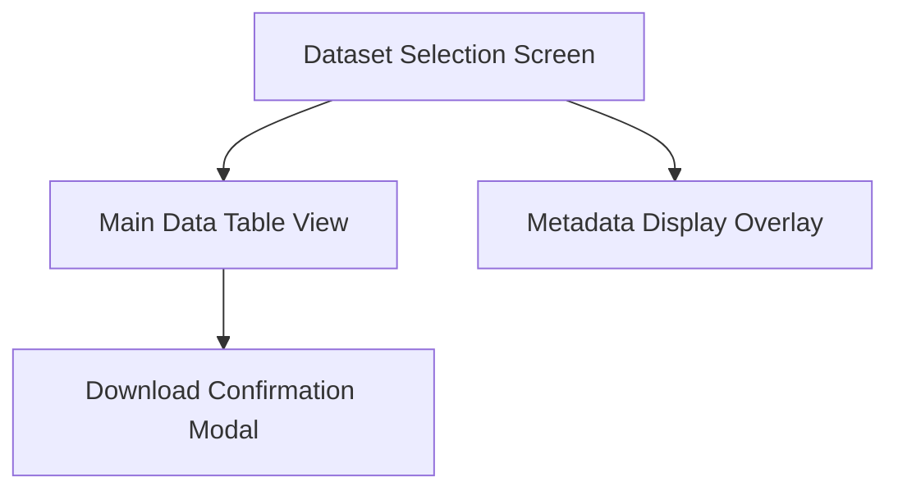

# Information Architecture (IA)

### Site Map / Screen Inventory

### Navigation Structure

**Primary Navigation:** Top header bar with dataset selector dropdown and download button for quick access to core actions.

**Secondary Navigation:** Table header controls (sortable columns, search bar) and pagination if needed for large datasets.

**Breadcrumb Strategy:** Not implemented, as the single-page app focuses on linear flow from selection to table to download without deep hierarchies.
