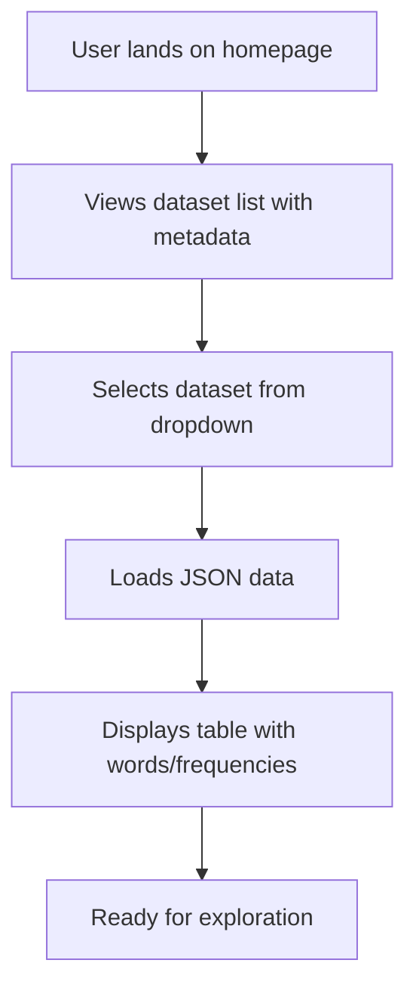
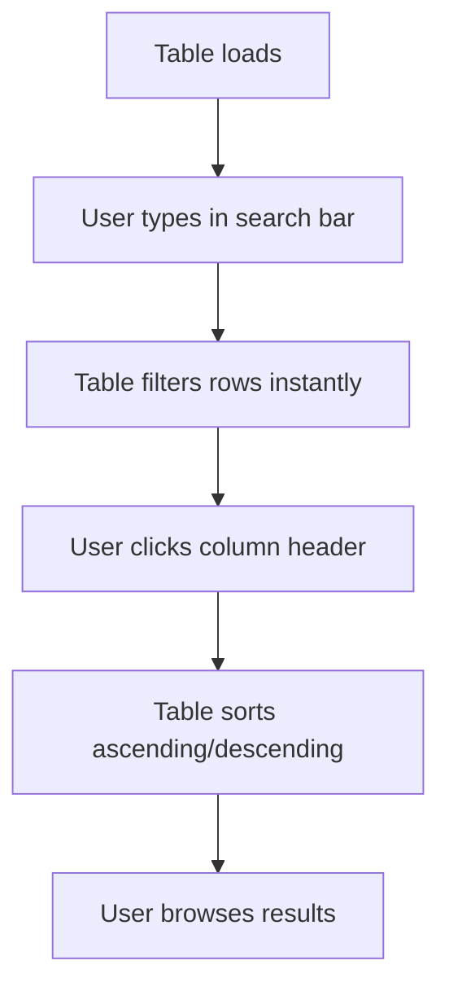

# User Flows

### Dataset Loading Flow

**User Goal:** Quickly select and load a dataset to begin data exploration.

**Entry Points:** Direct URL access or refresh on the homepage.

**Success Criteria:** Dataset loads in under 2 seconds, metadata (author, year) displays, and table populates without errors.

#### Flow Diagram



#### Edge Cases & Error Handling
- Invalid JSON: Show error message and fallback to default dataset.
- Large file: Display loading spinner; if over 10MB, warn user.
- No datasets available: Display message to contact admin (though static, assume files are present).

**Notes:** This flow emphasizes the PRD's goal of starting exploration within 1 minute, with metadata helping users choose relevant data.

### Data Exploration Flow

**User Goal:** Filter, sort, and browse word frequency data efficiently.

**Entry Points:** After loading a dataset or switching datasets.

**Success Criteria:** Users complete filtering/sorting within 30 seconds; search updates table in real-time.

#### Flow Diagram



#### Edge Cases & Error Handling
- Empty search: Show all rows.
- No matches: Display "No results found" with suggestion to clear search.
- Sorting large datasets: Ensure smooth performance without freezing.

**Notes:** Aligns with usability goals for efficiency; real-time updates prevent frustration.

### Download Flow

**User Goal:** Export filtered or full data for offline use.

**Entry Points:** From the table view after exploration.

**Success Criteria:** Download starts immediately; file includes metadata and current filter state.

#### Flow Diagram

```mermaid
graph TD
    A[User clicks download button] --> B[Shows confirmation modal with options]
    B --> C[User selects format (CSV/JSON)]
    C --> D[Generates file with current data]
    D --> E[Triggers browser download]
```

#### Edge Cases & Error Handling
- No data: Disable download button.
- Browser blocks download: Show instructions to allow pop-ups.
- Large exports: Warn if over 10,000 rows.

**Notes:** Supports the PRD's download goal; modal prevents accidental exports.
